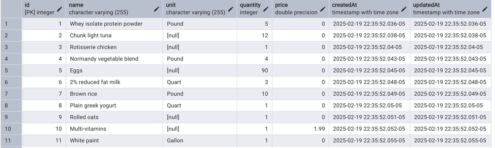

This project has been declared as no-longer-needed, I can pretty much everything via this graphQL endpoint, in a much cleaner fashion.
https://github.com/jrong1271/graphql-microservices

Create a model(s) (data structure) for shopping list
use sequelize nodejs ORM to interact with postgreSQL database

Checklists:
- [x] create a postgreSQL data model in a react.js app
- [x] create a data structure for the shopping list
  - A user can have multiple products.
  - A product can belong to multiple users.
  - A junction table (UserProducts) is required to track which users own which products.
  
- [x] store the shopping lists and items to the database
- [x] modify the database such that a price field can be stored for each item
  
- [x] multiply the quantity of each item in the shopping lists by two
- [x] create API endpoints to dynamically get a list of shopping lists and items
  - [x] create endpoint /list/:userId
  ```
  const usersWithProducts = await User.findAll({
    where: {
      id: userId,
    },
    include: {
      model: Product,
    },
  });
  ...
  const formattedResult = usersWithProducts.map(user => ({
    id: user.id,
    name: user.name,
    description: user.name + `'s shopping list`,
    email: user.email,
    items: user.Products.map(product => ({
      id: product.id,
      name: product.name,
      quantity: product.UserProducts.quantityOwned,
      price: product.price,
    })),
  }));
  ```
